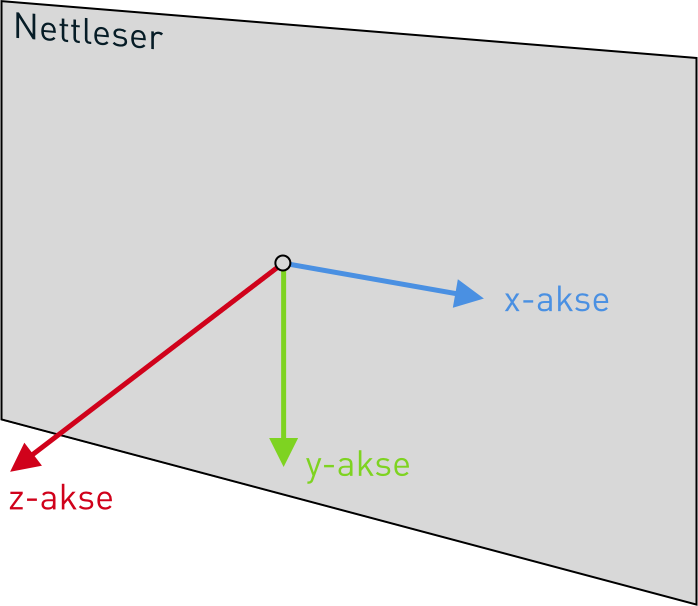

<style>
    .container {
        position: relative;
        height: 100px;
        width: 100px;
        margin: 40px;
    }

    .extra-margin {
        margin: 100px;
    }

    .extra-margin-bottom {
        margin-bottom: 100px;
    }

    .box {
        position: absolute;
        height: 100px;
        width: 100px;
    }

    .original {
        background: blue;
        color: white;
    }

    .tranform {
        background: red;
        opacity: 0.8;
    }
</style>

# Oppgave 0 - Bli kjent med `transform`

## Bakgrunn

CSS-propertien `transform` lar oss forflytte, skalere, skråstille og rotere elementer. Dette kan gjøres i tre dimensjoner – rundt x-, y- og/eller z-aksen. "Koordinatsystemet" i et nettleservindu er illustrert under.



I eksemplene under vil blå boks illustrere elementene _uten_ en gitt `transform` satt, mens den røde boksen vil vise resultatet av å definere en `transform`-property.

### Forflytting - `translate`

**Eksempel 1:**

```css
div {
  height: 100px;
  width: 100px;
  background: red;
  transform: translate(20px);
}
```

<div class="container">
<div class="box original">Tekst</div>
<div class="box tranform" style="transform: translate(20px)">Tekst</div>
</div>

Den røde boksen er den som er beskrevet av CSS-snutten over. Den blå boksen viser hvordan den samme boksen ville sett ut _uten_ `transform: translate(20px)`. `translate(20px)` gjør altså at boksen flytter seg 20px til høyre, eller - sagt på en annen måte - 20px i positiv retning langs x-aksen.

**Eksempel 2**

```css
div {
  height: 100px;
  width: 100px;
  background: red;
  transform: translate(20px, -20px);
}
```

<div class="container">
<div class="box original">Tekst</div>
<div class="box tranform" style="transform: translate(20px, -20px)">Tekst</div>
</div>

Ved å legge til et til parameter, kommaseparert fra det første, kan vi også flytte boksen i vertikal retning. Her har vi satt `translate(20px, -20px)`, så som i eksempel 1 flytter vi boksen `20px` i positiv x-retning, men i tillegg flytter vi den også `20px` i _negativ_ y-retning (altså oppover).

**Eksempel 3**

```css
div {
  height: 100px;
  width: 100px;
  background: red;
  transform: translateY(20%);
}
```

<div class="container extra-margin-bottom">
<div class="box original">Tekst</div>
<div class="box tranform" style="transform: translateY(50%)">Tekst</div>
</div>

Her har vi brukt en litt annen variant av `translate()`. Med `translateY()` definerer vi eksplisitt at vi vil flytte boksen kun langs y-aksen (vertikalt). Vi har også brukt `50%` i stedet for `-20px`, som betyr at vi forflytter nedover med en lengde som tilsvarer halvparten av høyden til boksen.

I **Eksempel 1** brukte vi `translate(20px)` for å flytte boksen mot høyre, men vi kunne like så gjerne skrevet `translateX(20px)`.

`translateZ()` lar oss forflytte elementer "ut av skjermen", men det kommer vi tilbake til senere.

### Skalering

**Eksempel 1:**

```css
div {
  height: 100px;
  width: 100px;
  background: red;
  transform: scale(2);
}
```

<div class="container extra-margin">
<div class="box original">Tekst</div>
<div class="box tranform" style="transform: scale(2)">Tekst</div>
</div>

Her har vi brukt `scale(2)` for å gjøre boksen dobbelt så stor. Tallet definerer altså multipliseringsfaktoren, så `scale(1)` ville ikke gjort noe med størrelsen. Legg merke til at skaleringen er uniform i alle retninger.

**Eksempel 2:**

```css
div {
  height: 100px;
  width: 100px;
  background: red;
  transform: scale(0.5, 1);
}
```

<div class="container">
<div class="box original">Tekst</div>
<div class="box tranform" style="transform: scale(0.5, 1)">Tekst</div>
</div>

På samme måte som med `translate()`, kan vi også med `scale()` definere to parametre. Her har vi satt det andre parameteret til `1`, og vi ser at høyden på boksen ikke endrer seg, men at det blir halvparten så stort i bredden. Boksen skaleres altså ned med 50% i x-retning, mens dimensjonen i y-retning bevares.

**Eksempel 3:**

```css
div {
  height: 100px;
  width: 100px;
  background: red;
  transform: scaleX(1.5);
}
```

<div class="container">
<div class="box original">Tekst</div>
<div class="box tranform" style="transform: scaleX(1.5)">Tekst</div>
</div>

Også `scale()` har alternative definisjoner; `scaleX()`, `scaleY()` og `scaleZ()`. Igjen kommer vi tilbake til dette med z-aksen senere.

### Skråstilling

**Eksempel 1**:

```css
div {
  height: 100px;
  width: 100px;
  background: red;
  transform: skewX(30deg);
}
```

<div class="container">
<div class="box original">Tekst</div>
<div class="box tranform" style="transform: skewX(30deg)">Tekst</div>
</div>

Nøyaktig hvordan `skewX()` fungerer er lettere forklart med et bilde, enn med ord:


Den kan kanskje være litt forvirrende at `skewX(30deg)` definerer vinkelen boksen danner med y-aksen, men tenk da heller på hvilken retning boksen _endrer_ seg langt.

**Eksempel 2**

```css
div {
  height: 100px;
  width: 100px;
  background: red;
  transform: skewY(30deg);
}
```

<div class="container">
<div class="box original">Tekst</div>
<div class="box tranform" style="transform: skewY(30deg); perspective(100px)">Tekst</div>
</div>

Igjen, `skewY()` er også lettere forklart med et bilde:


Og selv om vi definerer vinkelen i forhold til x-aksen, er det altså i y-retning at boksen endrer seg.

**Eksempel 3**

```css
div {
  height: 100px;
  width: 100px;
  background: red;
  transform: skew(30deg, 15deg);
}
```

<div class="container">
<div class="box original">Tekst</div>
<div class="box tranform" style="transform: skew(30deg, 15deg)">Tekst</div>
</div>

Akkurat som med `translate()` og `scale()`, kan vi definere definere `skew()` med to parametre, for å gjøre transformasjoner i både x- og y-retning.

### Rotasjon

**Eksempel 1:**

```css
div {
  height: 100px;
  width: 100px;
  background: red;
  transform: rotate(30deg);
}
```

<div class="container">
<div class="box original">Tekst</div>
<div class="box tranform" style="transform: rotate(30deg)">Tekst</div>
</div>

Her ser vi at `rotate(30deg)` roterer boksen 30° _med_ klokka. Tilsvarende ville `rotate(-30deg)` rotert boksen 30° _mot_ klokka. Hvis vi ser på bildet av "koordinatsystemet" til en nettleser igjen, ser vi at dette tilsvarer en rotasjon rundt z-aksen. På samme måte som vi har `translate(20px) == translateX(20px)`, vil en mer eksplisitt versjon av `rotate(30deg)` derfor være `rotateZ(30deg)`
