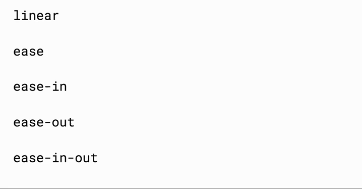

# 1 - Transisjoner og animasjoner

## Transisjoner - `transition`

Det er ganske vanlig at knapper endrer bakgrunnsfarge, når man har musepekeren over dem, slik som illustrert under.


Knappen over har følgende styling:

```css
button {
  font-size: 40px;
  padding: 20px;
  border: none;
  border-radius: 10px;
  color: white;
  background: #4fc7ef;
}
```

og vi definerer en alternativ bakgrunnsfarge, i tilfeller hvor det er en musepeker over knappen, ved å bruke en [pseudo-klasse](https://developer.mozilla.org/en-US/docs/Web/CSS/Pseudo-classes):

```css
button:hover {
  background: #008080;
}
```

For å gjøre fargeendringen litt "smoothere", kan vi bruke transisjoner.

> CSS transitions provide a way to control animation speed when changing CSS properties. Instead of having property changes take effect immediately, you can cause the changes in a property to take place over a period of time. For example, if you change the color of an element from white to black, usually the change is instantaneous. With CSS transitions enabled, changes occur at time intervals that follow an acceleration curve, all of which can be customized.  
> _Kilde_: [MDN](https://developer.mozilla.org/en-US/docs/Web/CSS/CSS_Transitions/Using_CSS_transitions)

I eksempelet under har definerer vi at overgangen mellom blå og grønn skal ta 400 millisekunder. Dette gjør vi ved å legge til `transition: 400ms`.


All CSS for knappen, inkludert transisjonen, blir altså:

```css
button {
  font-size: 40px;
  padding: 20px;
  border: none;
  border-radius: 10px;
  color: white;
  background: #4fc7ef;
  transition: 400ms;
}

button:hover {
  background: #008080;
}
```

`transition` er en såkalt [shorthand property](https://developer.mozilla.org/en-US/docs/Web/CSS/Shorthand_properties), som består av `transition-property`, `transition-duration`,`transition-timing-function` og `transition-delay`. I oppgavene under bruker vi [`transition`](https://developer.mozilla.org/en-US/docs/Web/CSS/transition) som eksempel.

## Oppgaver

Åpne opp `src/index.html` i en nettleser. Som i del 0 skal selve oppgavene løses ved å redigere `src/style.css`.

:trophy: 1. Legg til en transisjon til, ved å definere enn annen verdi for `color` i `button:hover`-selektoren.

Fordi vi kun har definert tiden transisjonen skal ta, animeres alle propertiene som endrer seg. Vi kan eksplisitt velge å kun animere én property, ved å spesifisere navnet på propertien, f.eks. `transition: background 400ms`.

Vi kan også definere to transisjoner med ulik hastighet, på følgende måte: `transition: property1 400ms, property2 200ms`.

:trophy: 1. Utvid `transition`-propertien, slik at `color`-transisjonen tar `200ms`.

For å utsette starttidspunktet for en transisjon, legger vi til et delay. Dette kan gjøres slik: `transition: color 200ms 100ms`. Her har vi lagt til et delay på `100ms`. Legg merke til at lengden på transisjonen defineres først.

:trophy: 3. Legg på en delay på `color`-transisjonen, slik at den slutter samtidig som `background`-transisjonen.

Den siste egenskapen ved en transisjon vi kan tweake på, er hvordan den akselererer, også kalt "timing function". De ulike alternativene er illustrert her:



Defaultverdien er `ease`, men vi kan endre den til f.eks. `linear` slik: `transition: color 200ms 100ms linear`.

Det er også mulig å lage en egendefinert akselerasjonskurve, ved å bruke [cubic-bezier](http://cubic-bezier.com/#.17,.67,.83,.67).

:trophy: 4. Sett akselerasjonen på `color`-transisjonen til `ease-in`. Prøv å bruke Chrome DevTools sin [cubic bezier editor](https://imgur.com/gallery/o2c15CZ) til å tweake på kurven.

:trophy: 5. Lag en ny knapp, som vokser gradvis og blir dobbelt stå stor når den får musepekeren over seg.

## Animasjoner - `animation`

Animasjoner er mye mer fleksible enn transisjoner. F.eks. kan vi definere flere mellomsteg (ikke kun start og slutt), og kan få en animasjon til å repeteres uendelig. Du kan lese mer om forskjellene, og i hvilke scenarioer man bruker hver av dem [her](https://cssanimation.rocks/transition-vs-animation/).

### Konfigurasjon

Vi kan konfigurere en animasjon på samme måte som vi konfigurerer en transisjon, men har i tillegg et par ekstra egenskaper:

* [`animation-duration`](https://developer.mozilla.org/en-US/docs/Web/CSS/animation-duration)
* [`animation-delay`](https://developer.mozilla.org/en-US/docs/Web/CSS/animation-delay)
* [`animation-timing-function`](https://developer.mozilla.org/en-US/docs/Web/CSS/animation-timing-function)
* [`animation-iteration-count`](https://developer.mozilla.org/en-US/docs/Web/CSS/animation-iteration-count)
* [`animation-name`](https://developer.mozilla.org/en-US/docs/Web/CSS/animation-name)
* [`animation-direction`](https://developer.mozilla.org/en-US/docs/Web/CSS/animation-direction)
* [`animation-fill-mode`](https://developer.mozilla.org/en-US/docs/Web/CSS/animation-fill-mode)
* [`animation-play-state`](https://developer.mozilla.org/en-US/docs/Web/CSS/animation-play-state)

Det går også an å definere animasjon med shorthand, som beskrevet [her](https://developer.mozilla.org/en-US/docs/Web/CSS/animation).

I motsetning til transisjoner, definerer vi ikke egenskapen som skal animeres. I stedet definerer vi dette med en `@keyframes`-regel. `animation-name` tilsvarer navnet på `@keyframes`-regelen.

### Oppsett av stegene i animasjonen

En `@keyframes`-regel ser f.eks. slik ut:

```css
@keyframes grow {
  0% {
    transform: scale(1);
  }
  100% {
    transform: scale(1.5);
  }
}
```

Her har vi definert to keyframes, én for starten (0%) og en for slutten av animasjonen (100%). En keyframe definerer altså hvordan det animerte elemente skal vises, på et gitt tidspunkt i animasjonen.

I tillegg til start og slutt, kan vi også legge til flere keyframes, som beskriver mellomliggende steg. F.eks. kan vi utvide eksemplet over slik:

```css
@keyframes grow {
  0% {
    transform: scale(1);
  }
  20% {
    transform: scale(0.2);
  }
  100% {
    transform: scale(1.5);
  }
}
```

### Oppgaver

Vi har laget en enkel animasjon [her](https://codepen.io/mfeiring/pen/BqywWZ), som flytter en boks fra venstre til høyre. Den er litt kjedelig, så vi skal utvide den litt.

:trophy: 6. Bruk `animation-iteration-count` for å loope animasjonen

Fått det til? Så bra, men det ser kanskje litt rart ut at firkanten hopper tilbake til venstre, etter hver repetisjon?

:trophy: 7. Bruk `animation-direction` for å få boksen til å animeres også fra høyre til venstre. Du kan evt utvide `@keyframes`-regelreen, slik at boksen er helt til høy ved 50%, og tilbake til venstre ved 100%.

:trophy: 8. Få firkanten til å rotere mens den beveger seg.
