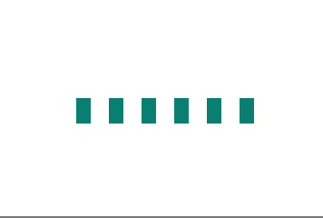
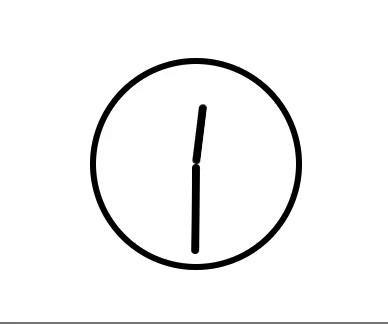

# 2 - Spin it!

I denne delen skal vi kombinere det vi har sett på i de tidligere delene.

En veldig enkel spinner kan lages ved å følge denne "oppskriften":

1. Lag en kvadratisk boks, og sett `border-radius: 50%`
2. Gi boksen en ramme (med egenskapen `border`), og sett rammefargen på toppen til å være gjennomsiktig (med `border-top-color`)
3. Legg på en animasjon, slik at sirkelen roterer

Men det går jo an å lage litt mer spennende spinnere/loadere også.

### :trophy: [Oppgave 1](https://codepen.io/mfeiring/pen/RePWGL)

Animer elementene som er satt opp, slik:

:bulb: Bruk `scale` til å endre høyden  
:bulb: Det kan være smart å sette opp litt flere `keyframes`

:school_satchel: [Fasit](https://codepen.io/mfeiring/pen/MPwwLZ)

### :trophy: [Oppgave 2](https://codepen.io/mfeiring/pen/xyGZGX)

Animer elementene som er satt opp, slik:

:bulb: Sentrum for animasjonen kan defineres med [`transform-origin`](https://developer.mozilla.org/en-US/docs/Web/CSS/transform-origin)

:school_satchel: [Fasit](https://codepen.io/mfeiring/pen/JmdGdO)
