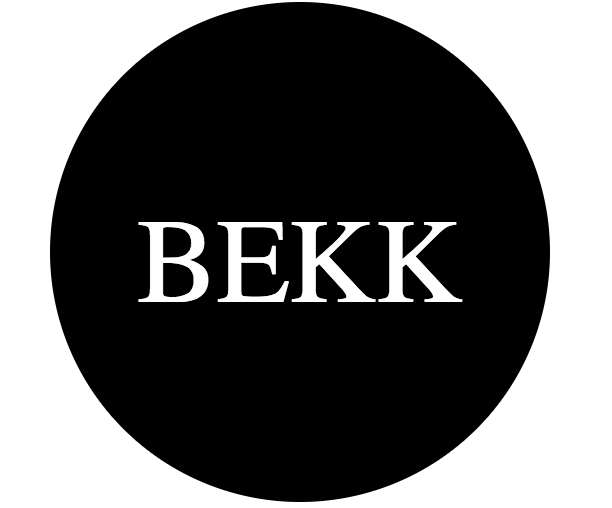
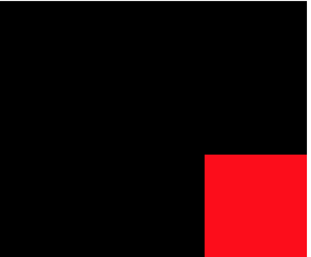
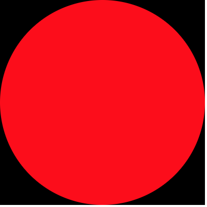

# SVG

SVG er et XML-språk, i likhet med HTML, som kan bli brukt til å tegne vektorgrafikk. Enten ved å spesfisere alle linjer og objekter eller ved å modifisere bilder.

## Et enkelt eksempel.

```html
<svg
  version="1.1"
  baseProfile="full"
  width="300" height="250"
  xmlns="http://www.w3.org/2000/svg"
>
  <circle cx="150" cy="125" r="125" fill="black" />

  <text x="150" y="150" font-size="60" text-anchor="middle" fill="white">BEKK</text>
</svg>
```

Ved å kopiere og lime inn koden over i en fil med navn bekk.svg og åpne den i nettleseren vil man se følgende skjermdump.



`svg`-elementet spesifiserer høyden (`height="250"`) og bredden (`width="300"`) til selve SVGen. Versjonen spesifiseres med `version`, `baseProfile` og `xmlns`.

`circle`-elementet tegner en sirkel med sentrum i `cx="150" cy="125"` med radius 125 piksler (`r="125"`) og svart bakgrunnsfarge (`fill="black"`).

`text`-elementet skriver teksten `BEKK` med hvit skrift (`fill="white"`) i skriftstørrelse 60px (`font-size="60"`) på posisjon spesifisert med `x="150" y="150" text-anchor="middle"`

## Posisjonering

Man bruker et koordinatsystem for å posisjonere elementer i svg-dokumentet.


Koordinatsystemet startet i øvre venstre hjørne (0,0). Posisjoner måles i piksler fra dette hjørnet, med positiv x-retning til høyre og positiv y-retning nedover.

> Legg merke til at dette er motsatt av hva man lærte på skolen.

:trophy: [Oppgave 1](https://codepen.io/sveinpg/pen/qJErqy): Flytt den rød firkanten ned i høyre hjørne.



:bulb: Mer om posisjonering kan leses på [MDN](https://developer.mozilla.org/en-US/docs/Web/SVG/Tutorial/Positions)

## Basic shapes

Det finnes former som man bruke som byggesteiner til å lage mer avanserte SVGer.

* [rect](https://developer.mozilla.org/en-US/docs/Web/SVG/Element/rect) brukes til å tegne rektangler.
* [circle](https://developer.mozilla.org/en-US/docs/Web/SVG/Element/circle) brukes til å tegne sirkler.
* [ellipse](https://developer.mozilla.org/en-US/docs/Web/SVG/Element/ellipse) er en mer generell versjon av `circle`.
* [line](https://developer.mozilla.org/en-US/docs/Web/SVG/Element/line) brukes til å tegne rette linjer mellom to punkter.
* [polyline](https://developer.mozilla.org/en-US/docs/Web/SVG/Element/polyline) brukes til å tegne linjer mellom flere punkter.
* [polygon](https://developer.mozilla.org/en-US/Web/SVG/Element/polygon) brukes på samme måte som `polyline`, men tegner en strek mellom første og siste punkt slik at man får en lukket form.
* [path](https://developer.mozilla.org/en-US/docs/Web/SVG/Element/path) er den mest generelle formen som kan brukes i SVG og kan brukes til å lage alle andre elementer. Man bruker attributten [d](https://developer.mozilla.org/en-US/docs/Web/SVG/Attribute/d) til å definere pathen som skal tegnes.

:trophy: [Oppgave 2](https://codepen.io/sveinpg/pen/ePmvey): Lag en svart firkant med en rød sirkel.



:bulb: Man bruker attributten `fill` til å sette fyllfarge.
:bulb: SVG-dokumenter leses fra toppen og nedover. Slik at elementer definert lenger ned i dokumentet tegnes på toppen av de som er tegnet allerede.

## Fill and stroke

For å bestemme fargen til et element bruker man attributtene `fill` og `stroke`. Begge tar samme verdier som farger som man kan bruke i css. Enten det er fargenavn (feks `red`) eller rgb-verdier (feks `rgb(255,0,0)`) eller hex-verdier (feks `#fffff`). Man kan i tillegg spesifisere hvor gjennomsiktig en farge skal være (opacity) med attributtene `fill-opacity` og `stroke-opacity`.

:trophy: [Oppgave 3](https://codepen.io/sveinpg/pen/KGwWbX): Gi hjertet rød fyllfarge og en svart strek rundt.


:bulb: Mer om [fill og stroke](https://developer.mozilla.org/en-US/docs/Web/SVG/Tutorial/Fills_and_Strokes)
