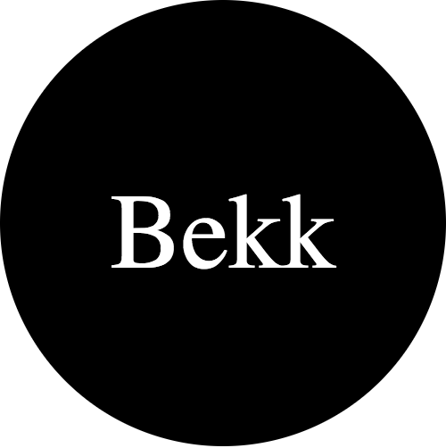
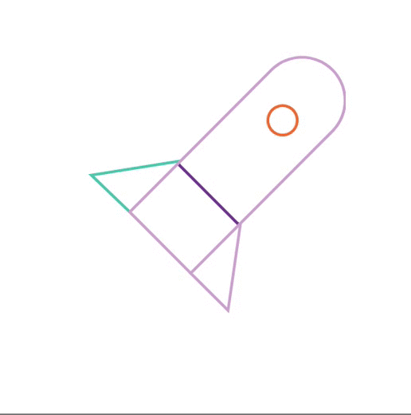
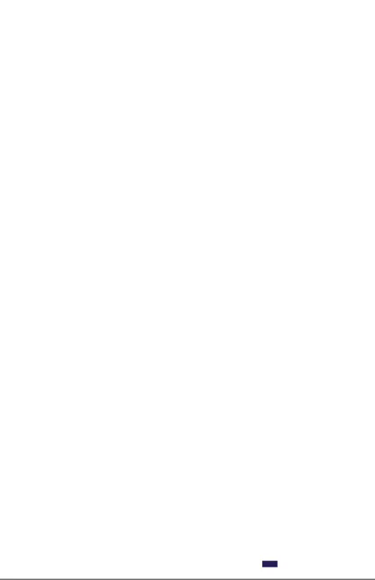

# 3 - SVG

SVG er et XML-basert språk som kan brukes til å tegne vektorgrafikk, enten ved å spesfisere alle linjer og objekter eller ved å modifisere bilder.

## Et enkelt eksempel

```html
<svg
  version="1.1"
  baseProfile="full"
  width="300" height="250"
  xmlns="http://www.w3.org/2000/svg"
>
  <circle cx="150" cy="125" r="125" fill="black" />

  <text x="150" y="150" font-size="60" text-anchor="middle" fill="white">Bekk</text>
</svg>
```

Ved å kopiere og lime inn koden over i en fil med navn `bekk.svg` og åpne den i nettleseren vil man se følgende bilde:



`svg`-elementet spesifiserer høyden (`height="250"`) og bredden (`width="300"`) til selve SVGen. Versjonen spesifiseres med `version`, `baseProfile` og `xmlns`.

`circle`-elementet tegner en sirkel med sentrum i `cx="150" cy="125"` med radius 125 piksler (`r="125"`) og svart bakgrunnsfarge (`fill="black"`).

`text`-elementet skriver teksten `Bekk` med hvit skrift (`fill="white"`) i skriftstørrelse 60px (`font-size="60"`) på posisjon spesifisert med `x="150" y="150" text-anchor="middle"`

### Posisjonering

Man bruker et koordinatsystem for å posisjonere elementer i svg-dokumentet.


Koordinatsystemet startet i øvre venstre hjørne (0,0). Posisjoner måles i piksler fra dette hjørnet, med positiv x-retning til høyre og positiv y-retning nedover.

> Legg merke til at den vertikale retningen er motsatt av hva man lærte på skolen.

### :trophy: [Oppgave 1](https://codepen.io/sveinpg/pen/qJErqy)

Flytt den røde firkanten ned i høyre hjørne.


:bulb: Flytter man firkanten for langt vil den havne utenfor viewporten.

:bulb: Mer om posisjonering kan leses på [MDN](https://developer.mozilla.org/en-US/docs/Web/SVG/Tutorial/Positions)

## Basic shapes

Det finnes former som man bruke som byggesteiner til å lage mer avanserte SVGer.

- [rect](https://developer.mozilla.org/en-US/docs/Web/SVG/Element/rect) brukes til å tegne rektangler.
- [circle](https://developer.mozilla.org/en-US/docs/Web/SVG/Element/circle) brukes til å tegne sirkler.
- [ellipse](https://developer.mozilla.org/en-US/docs/Web/SVG/Element/ellipse) er en mer generell versjon av `circle`.
- [line](https://developer.mozilla.org/en-US/docs/Web/SVG/Element/line) brukes til å tegne rette linjer mellom to punkter.
- [polyline](https://developer.mozilla.org/en-US/docs/Web/SVG/Element/polyline) brukes til å tegne linjer mellom flere punkter.
- [polygon](https://developer.mozilla.org/en-US/Web/SVG/Element/polygon) brukes på samme måte som `polyline`, men tegner en strek mellom første og siste punkt slik at man får en lukket form.
- [path](https://developer.mozilla.org/en-US/docs/Web/SVG/Element/path) er den mest generelle formen som kan brukes i SVG og kan brukes til å lage alle andre elementer. Man bruker attributten [d](https://developer.mozilla.org/en-US/docs/Web/SVG/Attribute/d) til å definere pathen som skal tegnes.

### :trophy: [Oppgave 2](https://codepen.io/sveinpg/pen/ePmvey)

Lag en svart firkant med en rød sirkel.


:bulb: Man bruker attributten `fill` til å sette fyllfarge.

:bulb: SVG-dokumenter leses fra toppen og nedover. Slik at elementer definert lenger ned i dokumentet tegnes på toppen av de som er tegnet allerede.

## Fill and stroke

For å bestemme fargen til et element bruker man attributtene `fill` og `stroke`. Begge tar samme verdier som farger som man kan bruke i css. Enten det er fargenavn (feks `red`) eller rgb-verdier (feks `rgb(255,0,0)`) eller hex-verdier (feks `#fffff`). Man kan i tillegg spesifisere hvor gjennomsiktig en farge skal være (opacity) med attributtene `fill-opacity` og `stroke-opacity`.

### :trophy: [Oppgave 3](https://codepen.io/sveinpg/pen/KGwWbX)

Gi hjertet rød fyllfarge og en svart strek rundt.


:bulb: Mer om [fill og stroke](https://developer.mozilla.org/en-US/docs/Web/SVG/Tutorial/Fills_and_Strokes)

## Styling med CSS

I tillegg til å sette attributter på objekter kan man bruke CSS til å style `fill` og `stroke`. Ikke alle attributter kan settes med CSS. `fill`, `stroke` og `stroke-dasharray` er blant attributtene som kan settes med CSS. Attributter som `width`, `height` og `path`-spesifikke kommandoer kan ikke settes med CSS.

> Man kan lese [SVG spesifikasjonen](https://www.w3.org/TR/SVG/propidx.html) for å se hvilke egenskaper som lar seg modifisere med CSS. Attributene som blir klassifisert som `properties` kan man modifisere med CSS.

Gitt at man har følgende svg:

```html
<?xml version="1.0" standalone="no"?>
<svg width="200" height="200" xmlns="http://www.w3.org/2000/svg" version="1.1">
  <rect x="10" height="180" y="10" width="180" id="MyRect"/>
</svg>
```

Med følgende styling:

```css
#MyRect {
  fill: red;
  stroke: black;
}
```

Vil det se slik ut.


> Legg merke til at man bruker `id` til å hente ut riktig element.

### :trophy: [Oppgave 4](https://codepen.io/sveinpg/pen/KGwWbX)

Gi hjertet rød fyllfarge og en svart strek rundt ved hjelp av css.

## Animasjoner med css.

Hvis du har vært inne på uxcup.bekk.no har du nok sett de kule animasjonene vi har der. Disse er laget av SVGer som er animert med CSS. Man setter en klasse på SVG-elementet og bruker denne klassen til å gi SVGen en animasjon via `animation` nøkkelen i CSS.

Skulle du ønske at du kunne lage like koselige animasjoner? Flaks for deg, det er nemlig det du skal nå.

### :trophy: [Oppgave 5](https://codepen.io/mfeiring/pen/JmdVNM)

Lag to keyframes (`shake` og `dash`) og få raketten til å se mer levende ut. Når du er ferdig burde du ha noe som ligner på raketten under.



:bulb: Man kan lage effekten av at raketten rister med `translate`

:bulb: Man kan lage effekten av at strekene beveger seg med `stroke-dashoffset`

:school_satchel: [Fasit](https://codepen.io/mfeiring/pen/KGpYQz)

### :trophy: [Oppgave 6](https://codepen.io/mfeiring/pen/ePNaBr)

I denne oppgaven har vi satt opp `@keyframes`, men du skal selv få definere `animation` og `stroke-dasharray`. Du kan lese mer om hvordan `stroke-dasharray` funker [her](https://css-tricks.com/svg-line-animation-works/).



:bulb: Bruk en kombinasjon av `animation-duration` og `animation-delay`, for å få samme keyframes til å funke for alle `path`-elementene.

:bulb: `animation-delay` er vel og bra, men det funker ikke hvis man ønsker å loope animasjonen. Hvis du ønsker å loope animasjonen, så må du nok trikse litt med keyframes. Du kan evt lese mer om dette [her](https://css-tricks.com/css-keyframe-animation-delay-iterations/)

:school_satchel: [Fasit](https://codepen.io/mfeiring/pen/qJdGRv)
